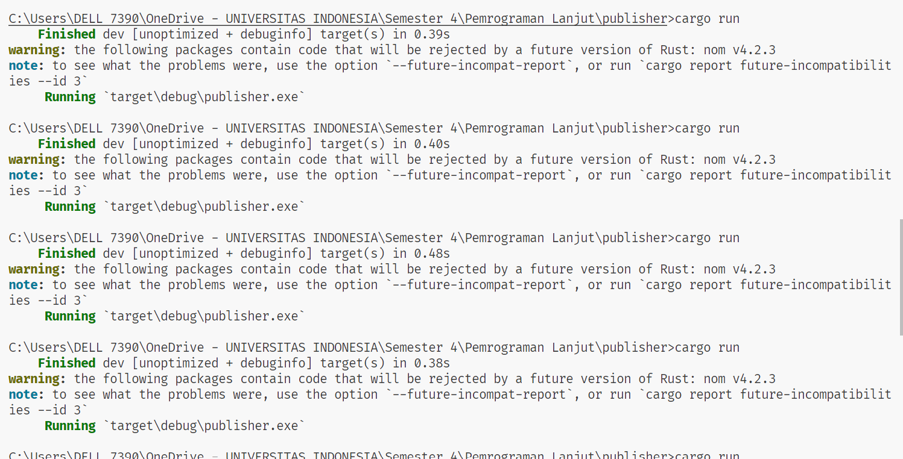

a. **What is amqp?**

AMQP (Advanced Message Queuing Protocol) adalah protokol standar aplikasi lapisan atas yang terbuka untuk middleware berorientasi pada pesan, dengan fokus pada antrian, routing, keandalan, dan keamanan.

b. **what it means? guest:guest@localhost:5672, what is the first `quest`, and what is the second `guest` and what is `localhost:5672` is for?**

- `guest:guest`: nama pengguna dan kata sandi untuk server. Dalam contoh ini nama pengguna maupun kata sandi adalah `guest`.
  
- `localhost`: nama host dari server.Dalam hal ini, server berjalan pada mesin yang sama dengan `client`.

- `5672`: nomor port tempat server berjalan. Hal ini, adalah port default untuk AMQP

**screen capture ketika mensimulasikan slow subscriber dengan banyak queue 20**

**Screen capture ketika mensimulasikan slow subscriber dengan 3 slow subcriber**

**reflection**
Setelah menjalankan tiga subscriber secara bersamaan dan memantau konsol serta browser RabbitMQ, terdapat beberapa hal yang dapat diamati.

Pertama, dengan menjalankan tiga subscriber, proses pemrosesan pesan dari publisher terbagi menjadi tiga kelompok. Hal ini dapat terlihat dari konsol masing-masing subscriber yang menampilkan pesan yang sedang diproses.Oleh karena itu, dengan membagi proses pemrosesan ini, beban kerja pada masing-masing subscriber menjadi lebih ringan, dan pesan dapat diproses lebih efisien.

Kedua, pengamatan terhadap browser RabbitMQ menunjukkan bahwa lonjakan pada antrian pesan mengalami penurunan lebih cepat daripada sebelumnya. Hal ini menunjukkan bahwa dengan menambahkan lebih banyak subscriber, sistem dapat menangani lonjakan pesan dengan lebih efisien dan mampu menyeimbangkan beban kerja dengan lebih baik.

Dari segi kode, ada beberapa hal yang mungkin dapat diperbaiki. Salah satunya adalah memperbaiki mekanisme pengelolaan antrian pesan agar lebih efisien. Selain itu, juga perlu memastikan bahwa setiap subscriber dapat menangani pesan dengan cepat tanpa mengalami bottleneck atau kegagalan.

Selain itu, penanganan kesalahan juga merupakan hal yang penting untuk diperhatikan. Pastikan bahwa setiap subscriber memiliki mekanisme yang memadai untuk menangani kesalahan, termasuk kesalahan yang dikembalikan oleh dependensi eksternal, untuk memastikan pemulihan yang baik dan umpan balik yang jelas kepada pengguna.

Terakhir Gantikan penggunaan unwrap() dengan match atau if let untuk menangani kesalahan secara lebih aman dan menghindari panic yang tidak terduga serta Sediakan implementasi untuk metode `get_handler_action` agar tidak menyebabkan panic saat runtime.

